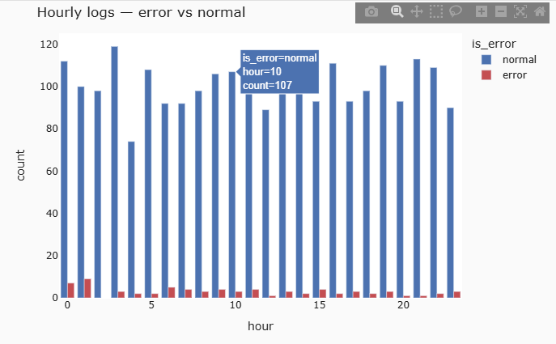

# 모두마켓 웹 접속 로그 — EDA & 시각화 보고서

## 1. 데이터 개요
- 행/열: (2502행, 7열)
- 주요 컬럼: log_id, session_id, response_time_ms, request_path, device, hour, is_error

## 2. 결측 진단 (missingno)
- `response_time_ms` 결측 비율: 4.8 %
- 결측 패턴: 앞부분(00:00~05:00 쯔음) 에 몰려있으며 끝부분에도 확인됨 — hour 기준 / 시간 정렬 후 관찰
- 의심 가설: 심야 시간대 측정 모듈 점검으로 측정값 누락 등

## 3. 정제와 검증 (전·후 분포 비교)
- 적용한 정제: 중복 제거 / device 표기 통일 / hour 이상치 / response_time_ms 결측 대체 / 극단치 클리핑
- KDE 비교 결과: KDE 에서 raw데이터보다 clean 데이터의 봉우리가 더 높아지긴 했으나, 분포 자체는 변하지 않았음. 박스플롯 결과 이상치 등도 변화 없음
- device distinct: 5 → 2 (정상) - device의 고윳값이 5에서 2(app, web)로 변경된 것으로 보아 표기 통일이 잘 적용된 것으로 확인

## 4. 탐색에서 도출한 새 질문
- 에러가 새벽시간 00:00~00:05:00 에 많은 것으로 보아 심심야 시간대 접속 환경(네트워크, 배치 작업, 트래픽 저조로 인한 서버 자원 재조정 등)이 에러율에 영향을 주는지 확인 필요
- request_path별 응답시간 분포에서 /product가 상대적으로 넓은 분포와 높은 이상치를 보임 — 특정 페이지(상품 상세)가 다른 페이지보다 응답이 느려지는 구간이 있는지, 이것이 에러 발생과도 연결되는지 추가 확인 필요

## 5. 전달용 차트 1개 (이미지 또는 코드 인용)
-  
- "전체 트래픽은 시간대별로 큰 변동 없이 안정적이지만, 에러는 00~02시 심야 구간에 상대적으로 몰려 있다."

## 6. 다음 분석 제안
- 00~05시 구간만 별도로 떼어내어 시간을 30분 단위로 세분화, 에러율이 정확히 어느 시점에 집중되는지 정밀 분석
- device(app/web)별로 response_time_ms 및 에러율을 비교하여 특정 플랫폼에서 성능 저하가 발생하는지 검증