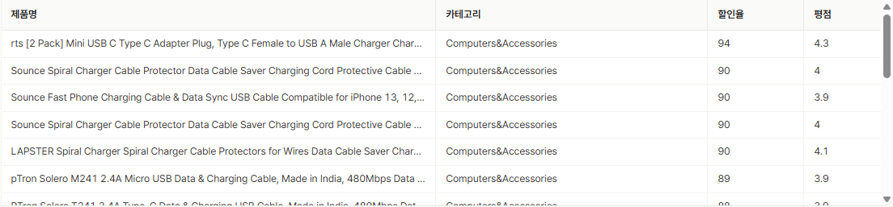
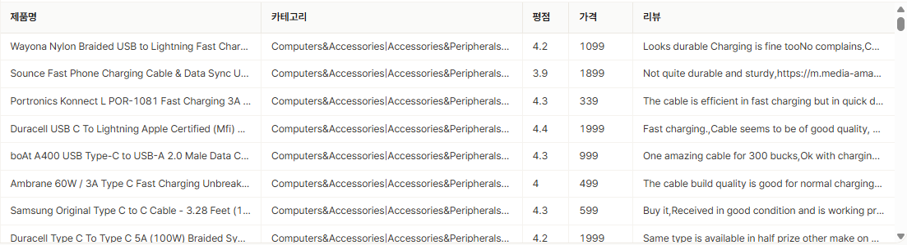
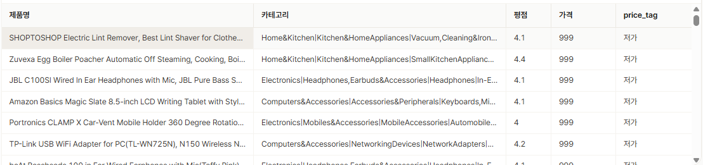
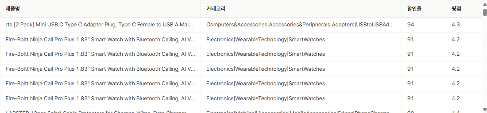
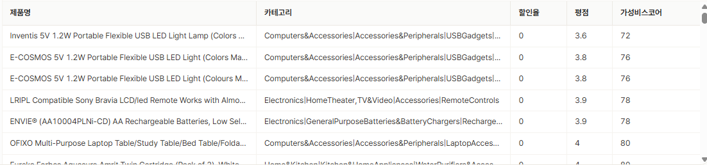
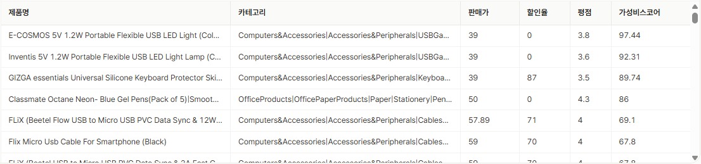
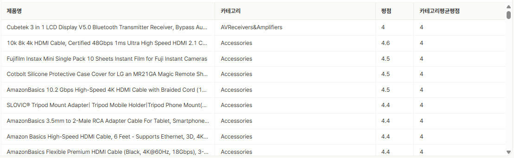

#  Amazon 데이터셋 기반 추천 시스템 설계 프로젝트

### 프로젝트 개요
이번 프로젝트는 **Amazon 데이터셋**을 기반으로 고객 맞춤형 추천 시스템을 설계하고 구현하는 작업입니다. Amazon은 전 세계적으로 가장 큰 전자상거래 플랫폼 중 하나로, 방대한 고객 리뷰와 제품 데이터를 보유하고 있습니다. 이번 프로젝트에서는 이러한 데이터를 SQL만을 사용하여 분석하고, 고객의 구매 경험을 향상시킬 수 있는 추천 시스템의 기초를 설계하는 것이 목표입니다.

---

## 추천 시스템 1

**1. 추천 시스템 이름**
➜ "카테고리 안에서 할인 혜택이 큰 상품이에요"

**2. 추천 시스템의 테마**
➜ 사용자가 관심 있는 카테고리를 선택하면, 그 카테고리 안에서 할인율이 가장 높은 상품을 우선적으로 보여줍니다. 카테고리별로 탐색 범위를 좁혀서, 전체 상품 중 할인율만 보는 것보다 실제 쇼핑 맥락에 맞는 추천을 제공합니다.

**3. 구현 로직**
➜ `category` 필드는 `대분류|중분류|소분류` 형태의 문자열이라, `SPLIT`으로 나눈 뒤 `UNNEST`로 각 레벨을 개별 행으로 펼쳐서 원하는 카테고리 값으로 필터링했습니다. 이후 `discount_percentage` 기준 내림차순 정렬로 할인율이 높은 상품을 상위에 노출합니다.

```sql
SELECT 
    product_name AS 제품명,
    category_value AS 카테고리,
    discount_percentage AS 할인율,
    rating AS 평점
FROM amazon_clean,
     UNNEST(SPLIT(category, '|')) AS t(category_value)
WHERE 
  category_value = 'Computers&Accessories' -- 원하는 카테고리로 수정 가능
ORDER BY 
  discount_percentage DESC
LIMIT 20
```

**4. 결과**

➜ 'Computers&Accessories' 카테고리 안에서 할인율 89~94%에 달하는 케이블/충전기류 상품들이 상위에 노출되었고, 평점도 3.9~4.3으로 낮지 않아 실제로 "혜택도 크고 품질도 검증된" 상품이 잘 걸러지는 것을 확인

---

## 추천 시스템 2

**1. 추천 시스템 이름**
➜ "리뷰에서 '내구성 좋다'고 언급된 상품이에요"

**2. 추천 시스템의 테마**
➜ 평점이나 리뷰 수 같은 정량적 지표가 아니라, 리뷰 **본문 텍스트**에서 특정 니즈(예: 내구성, 방수, 가성비 등)와 관련된 키워드를 직접 검색해 상품을 찾아줍니다. 사용자가 구체적인 사용 목적을 갖고 있을 때 유용한 추천 방식입니다.

**3. 구현 로직**
➜ `review_content` 컬럼에 `LIKE` 연산자와 와일드카드(`%`)를 사용해 특정 키워드가 포함된 리뷰가 하나라도 있는 상품을 필터링했습니다. 단, 이 필드는 여러 리뷰가 콤마로 뭉쳐 있는 구조라, "어떤 리뷰에서 나왔는지"보다는 "상품 단위로 해당 키워드 언급이 있었는지"만 판별 가능하다는 한계가 있습니다.

```sql
SELECT 
  product_name AS 제품명,
  category AS 카테고리,
  rating AS 평점,
  actual_price AS 가격,
  review_content AS 리뷰
FROM amazon_clean
WHERE 
  review_content LIKE '%durable%' -- 원하는 키워드로 수정 가능
-- 예시 키워드: waterproof(방수), fast(배송/충전 빠름), durable(내구성), worth(가성비)
```

**4. 결과**

➜ 'durable' 키워드로 검색한 결과, 평점 3.9~4.4대의 USB/충전 케이블 제품들이 다수 검색되었고, 리뷰 내용에도 "durable", "cable is efficient" 등 내구성 관련 언급이 실제로 포함되어 있어 키워드 매칭이 의도대로 작동함을 확인

---

## 추천 시스템 3

**1. 추천 시스템 이름**
➜ "예산에 맞는 상품을 찾아드려요"

**2. 추천 시스템의 테마**
➜ 정가(`actual_price`)를 저가/중가/고가 구간으로 나누고, 사용자가 원하는 예산 구간 안에서만 상품을 볼 수 있도록 합니다. 가격 분포(사분위수)를 먼저 분석해 구간 경계값을 데이터 기반으로 설정했습니다.

**3. 구현 로직**
➜ `PERCENTILE_CONT`로 가격 분포의 33/66 퍼센타일을 확인해 구간 경계(999 / 2900)를 정했습니다. `CASE WHEN`으로 가격 구간 라벨(`price_tag`)을 만들고, 특정 구간만 보고 싶을 때는 서브쿼리로 감싸 바깥에서 `WHERE`로 필터링했습니다.

```sql
-- (탐색) 정가 분포 확인
SELECT 
  MIN(actual_price) AS 최소값,
  MAX(actual_price) AS 최대값,
  ROUND(AVG(actual_price), 2) AS 평균값,
  PERCENTILE_CONT(0.33) WITHIN GROUP (ORDER BY actual_price) AS 하위33퍼,
  PERCENTILE_CONT(0.66) WITHIN GROUP (ORDER BY actual_price) AS 상위66퍼
FROM amazon_clean

SELECT *
FROM (
  SELECT  
    product_name AS 제품명,
    category AS 카테고리,
    rating AS 평점,
    actual_price AS 가격,
    CASE 
      WHEN actual_price <= 999 THEN '저가' 
      WHEN actual_price <= 2900 THEN '중가' 
      ELSE '고가' 
    END AS price_tag
  FROM amazon_clean
) 
WHERE price_tag = '저가' -- 저가, 중가, 고가 중 선택
ORDER BY 가격 DESC
```

**4. 결과**

➜ '저가'(999원 이하) 구간으로 필터링한 결과, 청소기/조리도구/헤드셋 등 카테고리는 서로 다르지만 모두 가격 999원, 평점 4.0~4.4대인 상품들이 골고루 나와, 예산 구간 내에서 품질 좋은 상품을 찾는 목적에 맞게 작동

---

## 추천 시스템 4

**1. 추천 시스템 이름**
➜ "할인과 퀄리티를 동시에 누릴 수 있는 상품이에요" or "적은 돈으로 좋은 평점을 받는 상품이에요"

**2. 추천 시스템의 테마**
➜ 처음에는 "할인율 × 평점"을 결합한 스코어(ver.2)를 시도했으나, 할인율이 0인 상품은 원가가 낮고 평점이 좋아도 스코어가 0이 되어버리는 문제가 있었습니다. 이를 보완하기 위해 "최종 판매가 대비 평점"(ver.3)도 함께 계산해보았는데, 이번엔 할인율이라는 정보가 스코어에서 완전히 배제되는 특징이 있었습니다. 두 지표는 각각 "할인 혜택을 크게 받는 것"과 "최종적으로 지불하는 가격 대비 가치가 좋은 것"이라는 서로 다른 기준을 담고 있어, 하나로 억지로 합치기보다 **두 가지 가성비 스코어를 각각 제시하여 사용자가 자신의 기준(할인 혜택 중심 vs 최종 가격 중심)에 맞게 선택할 수 있도록** 컨셉을 확정했습니다.

**3. 구현 로직**

➜ 시도한 세 가지 버전을 순서대로 검증했습니다.
- ver.1: 할인율·평점 각각 `ORDER BY` 정렬 → 두 지표가 결합되지 않고 할인율에 좌우되는 문제
- ver.2: 할인율×평점(스케일링) 곱셈 스코어 → 할인율 0인 상품이 부당하게 낮은 점수를 받는 문제
- ver.3(최종): `discounted_price`가 할인 여부와 무관하게 이미 "실제 지불 가격" → "할인을 받았는지 여부"는 반영이 되지 않고 최종 판매가에만 영향

➜ 결국 가성비를 어떻게 정의할 것인가에 따라 **아래의 두가지 방법**으로 구분한 뒤 억지로 합치지 말고 각자의 방법을 살리기로 함
  - (A) "원래는 비쌌는데 할인 받아서 싸게 살 수 있고 평점도 좋은 상품"  → ver. 2
  - (B) "그냥 최종적으로 돈 대비 평점이 좋은 상품" (할인 여부 상관없이) → ver. 3

```sql
-- ver. 1 단순 ORDER BY로 순서 매기기
SELECT 
  product_name AS 제품명,
  category AS 카테고리,
  discount_percentage AS 할인율,
  rating AS 평점
FROM amazon_clean -- 여기서 자신이 보고싶은 카테고리로 수정 가능
ORDER BY 
  discount_percentage DESC, rating DESC
--> 근데 이러면 이제 할인율 80, 평점 2.0 vs 할인율 75, 평점 5.0 이어도 할인율이 무조건 높은게 위에 뜸


-- ver. 2 할인율 X 평점 (스케일링 O)
SELECT 
  product_name AS 제품명,
  category AS 카테고리,
  discount_percentage AS 할인율,
  rating AS 평점,
  CASE WHEN discount_percentage = 0 THEN rating * 20 ELSE discount_percentage * (rating * 20) END AS 가성비스코어
FROM amazon_clean 
ORDER BY 
  가성비스코어
--> 또 이렇게 하면 할인율이 0이지만 원래 원가가 낮은 상품이 가성비 스코어가 낮아짐..

-- ver. 3 discounted_price 열 사용
SELECT 
  product_name AS 제품명,
  category AS 카테고리,
  discounted_price AS 판매가,
  discount_percentage AS 할인율,
  rating AS 평점,
  ROUND((rating * 1000 / discounted_price), 2) AS 가성비스코어 --가격 대비 평점
FROM amazon_clean
ORDER BY 
  가성비스코어 DESC
-- > discounted_price 하나만 쓰면 "할인을 받았는지 여부"는 스코어에 전혀 반영이 안 되고, 그냥 최종 판매가가 싼 상품이 유리해짐..
```

**4. 결과**
**ver. 1 단순 ORDER BY로 순서 매기기**

➜ ver.1(할인율·평점 정렬): 할인율 90%대 상품이 상위를 독점해, 평점 차이가 순위에 반영되기 어려운 문제를 확인
**ver. 2 할인율 X 평점 (스케일링 O)**

➜ ver.2(할인율×평점 곱셈): 가격이 낮은 상품은 흔히 '가성비'라는 키워드와 들어 맞지만 할인을 하지 않아 가성비스코어가 낮게 나타나는 왜곡될 수 있음을 확인했지만, "원래는 비쌌지만 크게 할인받아 가치 있게 살 수 있는 상품"을 잘 짚어냄
**ver. 3 discounted_price 열 사용**

➜ ver.3(최종, 판매가 대비 평점): 판매가 39~59대의 저가 상품들이 90점대 가성비스코어로 상위에 올라, 할인 여부와 무관하게 "단순 적은 판매가로 좋은 평점"을 얻는 실제 목적과 어긋나는 문제를 확인했지만, "적은 돈으로 좋은 평점을 받는 상품"을 잘 짚어냄

---

## 추천 시스템 5

**1. 추천 시스템 이름**
➜ "카테고리 안에서 평점이 유독 좋은 상품이에요"

**2. 추천 시스템의 테마**
➜ 단순히 전체 상품 중 평점이 높은 순서가 아니라, **같은 카테고리 안의 다른 상품들과 비교했을 때** 상대적으로 평점이 높은 상품을 찾아줍니다. 예를 들어 평점 4.0이 낮아 보일 수 있어도, 해당 카테고리 평균이 3.5라면 상대적으로 우수한 상품일 수 있습니다.

**3. 구현 로직**
➜ `category`는 `대분류|중분류|소분류` 계층 구조라, `SPLIT(category, '|')[n]`으로 원하는 레벨의 값을 고정해 그룹 기준으로 사용했습니다. `AVG(rating) OVER (PARTITION BY ...)` 윈도우 함수로 개별 상품의 행은 유지하면서, 같은 카테고리 그룹의 평균 평점을 함께 계산해 비교할 수 있도록 했습니다.

```sql
SELECT 
  product_name AS 제품명,
  SPLIT(category, '|')[3] AS 카테고리,
  rating AS 평점,
  ROUND(AVG(rating) OVER (PARTITION BY SPLIT(category, '|')[3]), 1) AS 카테고리평균평점
FROM amazon_clean
ORDER BY 카테고리, 평점 DESC
```

**4. 결과**

➜ 'Accessories' 카테고리 내에서 평점 4.4~4.6인 상품들이 카테고리 평균(4.0) 대비 높은 평점을 기록해 상위에 노출되었으며, 개별 상품 평점과 카테고리 평균을 나란히 비교